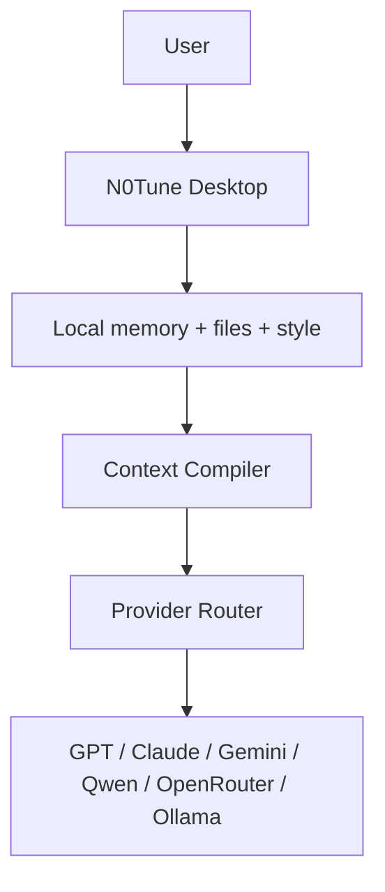

<p align="center">
  
</p>

<p align="center"><strong>Fine-tune any AI. Without fine-tuning.</strong></p>

<p align="center">
  Bring your model. N0Tune adds local memory, a persona profile, indexed files,<br/>
  semantic cache, and a context compiler. Same model. Personal answer.
</p>

<p align="center">
  <a href="docs/install.md">Install</a> ·
  <a href="docs/product-direction.md">Direction</a> ·
  <a href="docs/how-it-works.md">How it works</a> ·
  <a href="docs/context-tuning.md">Context-tuning</a> ·
  <a href="docs/wire-to-claude.md">Wire to Claude</a> ·
  <a href="docs/roadmap.md">Roadmap</a>
</p>

<p align="center">
  <sub>Pronounced "no tune" — the display wordmark is the logo above; packages, CLIs, and Docker images all use <code>n0tune</code>.</sub>
</p>

## What N0Tune Is

N0Tune is a **context-tuning system**. You bring any model — GPT, Claude,
Gemini, Qwen, OpenRouter, Ollama, LM Studio, anything OpenAI-compatible —
and N0Tune adds the personalization layer on top:

- **Memory** — vector-embedded preferences, facts, projects (per user / per app).
- **Persona / style profile** — tone, depth, format, things to avoid.
- **Indexed files (RAG)** — your folders chunked, embedded, retrieved.
- **Semantic cache** — reuses an answer when a similar prompt was seen before.
- **Context compiler** — picks the relevant memories + chunks, fits a token budget, builds a compact prompt.
- **Continual learning** — old similar memories get summarized into denser ones over time.
- **Provider router** — calls OpenAI / Anthropic / Gemini / any OpenAI-compatible upstream with the compiled prompt.

Fine-tuning changes the model's weights. N0Tune changes the **prompt**.
Same model. Different prompt. Personal answer. No GPU, no training data,
no per-provider lock-in.

### Two surfaces, one system

| You want…                                                  | Use…                                                                            |
| ---------------------------------------------------------- | ------------------------------------------------------------------------------- |
| A standalone personal AI on your machine                   | **N0Tune Desktop** — tray + hotkey + chat + memory + file context (Tauri app)   |
| Personalization inside Claude Code / Cursor / Codex CLI    | **N0Tune MCP server** — 7 tools your AI tool calls                              |
| A team / app backend                                       | **N0Tune Gateway** — FastAPI server + dashboard + audit logs + RBAC             |
| To integrate from code                                     | **N0Tune SDKs** — Python + TypeScript, plus LangChain / LlamaIndex / Vercel AI  |

Both surfaces are the same system — same context compiler, same memory
schema. The Desktop talks to the Gateway via local API; the MCP server
talks to the Gateway via local API; the SDKs talk to the Gateway via
local API. **The model never sees N0Tune** — it just receives a normal
prompt with useful context.

N0Tune is **not**:

- a model or a fine-tuning service
- a hosted-model provider
- a secret manager
- a guarantee against hallucinations
- a system that stores private memory in the cloud by default (Desktop is
  local-first; Gateway only persists when you run the server)

## Product Editions

| Edition            | Who it is for                                             | Status (v0.1.1)                                                                              |
| ------------------ | --------------------------------------------------------- | -------------------------------------------------------------------------------------------- |
| **N0Tune Desktop** | Normal users who want armor around their AI tools         | Tauri app: tray + global hotkey + status overlay + SQLite + OS keychain + fallback chat      |
| **N0Tune MCP**     | Claude Desktop, Claude Code, Cursor, Codex CLI            | Stdio MCP server with seven tools — production-ready integration path                        |
| **N0Tune Gateway** | Power users + teams running an API/server                 | FastAPI + Postgres + pgvector + Redis + dashboard + audit logs + RBAC + continual-learning   |
| **N0Tune Core**    | Developers building context-tuned apps                    | Python package with the shared compiler / security / token primitives                        |
| **N0Tune CLI**     | Developers and power users                                | `n0tune` CLI: doctor, demo, compile, memory consolidate, persona, files, mcp install         |

The public surface is **Desktop + MCP**. Gateway powers it underneath
and stays available as a server mode for teams.

## Context Guard (design phase)

N0Tune can check whether an AI agent stays aligned with your project
plan. **Context Guard** reads the project's stored memories, indexed
docs, current roadmap phase, and security rules, then tells you when a
proposed plan, response, or diff has drifted away.

It catches things like:

- hallucinated claims ("tests pass", "all providers supported")
- phase drift (implementing v0.2 features during a v0.1 phase)
- terminology mistakes (saying N0Tune "fine-tunes" any model)
- benchmark inflation (claiming 80% token savings when the doc says 17.4%)
- security violations (binding MCP to 0.0.0.0, storing secrets as memories)
- documentation/implementation mismatch

Example:

> Agent: "N0Tune fine-tunes GPT using local memory."
>
> Context Guard: `terminology_error (high)` — "N0Tune context-tunes
> models. It does not change model weights." (cites
> `docs/product-direction.md`)

Status: **Phase CG-0 design only.** The spec is documented; no engine
code ships yet. Implementation lands across CG-1 (rule engine) →
CG-2 (API) → CG-3 (dashboard) → CG-4 (CLI) → CG-5 (MCP tools) → CG-6
(dogfooding pass). Full design:
[`docs/context-guard.md`](docs/context-guard.md) (user-facing),
[`docs/alignment-checker.md`](docs/alignment-checker.md) (technical),
[`docs/dogfooding-alignment.md`](docs/dogfooding-alignment.md)
(dogfooding agenda).

## How It Works



For every request, N0Tune decides:

- which memories matter
- which local file chunks matter
- which style profile should apply
- which context is unsafe, stale, redundant, or too expensive
- whether a semantic cache entry can be reused
- what compact context should be sent to the selected model

The selected model receives a normal prompt with useful context. The model weights do not change.

## Fine-Tuning vs N0Tune

| Fine-tuning                              | N0Tune                                                  |
| ---------------------------------------- | ------------------------------------------------------- |
| Changes model weights                    | Changes request context                                 |
| Expensive for large models               | Works with hosted or local models                       |
| Slow to update                           | Updates as memory/files/style change                    |
| Usually provider-specific                | Designed for any provider or OpenAI-compatible endpoint |
| Needs training data and often GPU access | Needs local memory, files, and context compilation      |
| Not personal per user unless retrained   | Personal per user/persona by design                     |

N0Tune is not a replacement for all fine-tuning use cases. It is for personalization, memory, local files, style, and transparent context control.

## Current Repository Status (v0.1.1)

What ships today and works end-to-end (smoked locally against the live
Docker stack):

- **Desktop (Tauri 2):** tray icon + global hotkey
  (`Cmd+Shift+Space` / `Alt+Space`), quick-remember overlay, status
  overlay (tokens, cache hit, memory count), SQLite local storage,
  OS-native keychain for provider keys, window-close-to-tray for ambient
  use. Windows + macOS + Linux. iOS/Android explicitly out of scope.
- **MCP server** with seven tools:
  `n0tune_save_memory`, `n0tune_search_memories`, `n0tune_forget_memory`,
  `n0tune_context_preview`, `n0tune_compile_context`,
  `n0tune_get_persona`, `n0tune_set_persona`. Stdio-only, no network
  listener.
- **Gateway (FastAPI):** memory CRUD + lifecycle + scope + export,
  style profile CRUD, document chunking, prompt-injection scoring,
  context preview with trace + token estimates, semantic cache,
  provider router (OpenAI-compatible / Anthropic / Gemini wire shapes),
  OpenAI-compatible chat completions endpoint, API keys + RBAC + audit
  logs, **continual-learning loop**
  (`POST /v1/memories/consolidate`).
- **Dashboard (Next.js):** memories, style profile, documents, context
  preview, semantic cache view, audit logs, security panel, Context Lab
  (per-user comparison). Playwright e2e green as of v0.1.1.
- **CLI:** `n0tune doctor`, `demo`, `compile <message>`,
  `memory list/add/delete/export/consolidate`, `persona export/import`,
  `files sync`, `mcp install`.
- **Integrations:** Python + TypeScript SDKs, MCP server,
  LangChain (`BaseRetriever` + memory tool), LlamaIndex
  (`BaseRetriever` returning `NodeWithScore`), Vercel AI SDK (provider
  factory + context-preview helper), Markdown-folder connector.
- **Eval + dogfooding:** `python -m evals token_savings` reproduces
  ~17.4 % token savings. `scripts/seed-dogfooding.ps1` indexes the
  armor docs and seeds memories so the compiler answers questions
  about N0Tune in the right framing.

Open follow-ups: signed Windows + notarized macOS installers (needs your
developer certs), latency-true streaming pass-through, MCP-native Gemini
CLI once the upstream protocol lands, more eval scenarios beyond
`token_savings`. None of these block the armor surface.

## Desktop Quickstart

Most users start here. Two routes:

**A. Download a pre-built installer** from the
[latest release](https://github.com/MITPOAI/N0Tune/releases/latest)
(`.exe` / `.msi` for Windows, `.dmg` for macOS, `.deb` / `.AppImage` for
Linux). See [`docs/install.md`](docs/install.md) for the OS-specific
trust steps (`xattr` on macOS, SmartScreen on Windows).

**B. Build from source** if no release matches your platform:

```bash
git clone https://github.com/MITPOAI/N0Tune.git
cd N0Tune
npm install
npm --workspace apps/desktop run tauri:dev          # dev mode
npm --workspace apps/desktop run tauri:build        # installer
```

After install, N0Tune lives in your tray. Press
`Cmd+Shift+Space` (mac) or `Alt+Space` (Windows/Linux) anywhere to
quick-save a memory. The status overlay shows live tokens, cache hits,
and memory count.

To wire N0Tune into your AI tool (Claude / Cursor / Codex CLI),
paste the prompt from [`docs/install.md#the-exact-prompt`](docs/install.md#the-exact-prompt)
into your AI assistant and follow along.

## Gateway Quickstart

Power-user path: run the server, dashboard, Postgres, and Redis to get
the MCP surface, OpenAI-compatible proxy, and multi-device sync.

```powershell
Copy-Item .env.example .env
docker compose config
docker compose up --build
```

Open:

- Dashboard: `http://localhost:3000`
- API health: `http://localhost:8000/health?deep=true`

The dashboard includes a **Context Lab** tab for a no-fake-output product demo:

- create/select User A and User B
- seed different style memories and style profiles
- ask the same question for both users
- call `/v1/context/preview` for both
- compare selected memories, selected document chunks, compiled context, token estimates, token savings, warnings, and trace entries side by side

Context Lab uses context preview only. It does not fake LLM responses.

Run checks:

```powershell
.\scripts\check-mvp.ps1
.\scripts\smoke-mvp.ps1
npm run test
npm run build
```

## Example Gateway API Calls

Create a memory:

```powershell
Invoke-RestMethod -Method Post -Uri http://localhost:8000/v1/memories -ContentType "application/json" -Body '{
  "app_id": "demo",
  "user_id": "user_123",
  "type": "preference",
  "text": "User prefers short practical answers.",
  "confidence": 0.9
}'
```

Preview context:

```powershell
Invoke-RestMethod -Method Post -Uri http://localhost:8000/v1/context/preview -ContentType "application/json" -Body '{
  "app_id": "demo",
  "user_id": "user_123",
  "message": "Explain RAG like before",
  "max_context_tokens": 1200
}'
```

Chat through N0Tune:

```powershell
Invoke-RestMethod -Method Post -Uri http://localhost:8000/v1/chat -ContentType "application/json" -Body '{
  "app_id": "demo",
  "user_id": "user_123",
  "message": "Explain RAG like before",
  "model": "n0tune/dev"
}'
```

`n0tune/dev` is a local development provider. It proves routing and context compilation without making an external LLM call. Configure `N0TUNE_PROVIDER_BASE_URL` and `N0TUNE_PROVIDER_API_KEY` for an OpenAI-compatible provider.

## SDK Usage

```ts
import { N0TuneClient } from "@n0tune/sdk";

const client = new N0TuneClient({ baseUrl: "http://localhost:8000" });

await client.createMemory({
  app_id: "demo",
  user_id: "user_123",
  type: "preference",
  text: "User prefers concise answers.",
});

const preview = await client.contextPreview({
  app_id: "demo",
  user_id: "user_123",
  message: "Explain RAG like before",
});

console.log(preview.compiled_context);
```

## OpenAI-Compatible Proxy

Endpoint:

```text
POST /v1/openai/chat/completions
```

Point a compatible client at:

```text
OPENAI_BASE_URL=http://localhost:8000/v1/openai
```

Use headers:

- `X-N0Tune-App-ID: demo`
- `X-N0Tune-User-ID: user_123`
- `Authorization: Bearer <app-api-key>`

## MCP Integration

Run:

```powershell
node integrations/mcp-server/src/server.mjs
```

Current tools:

- `n0tune_search_memories`
- `n0tune_save_memory`
- `n0tune_get_style_profile`
- `n0tune_search_docs`
- `n0tune_context_preview`
- `n0tune_forget_memory`

See [docs/mcp.md](docs/mcp.md).

## Product Docs

- [Product direction](docs/product-direction.md)
- [Editions](docs/editions.md)
- [Context-tuning](docs/context-tuning.md)
- [Desktop architecture](docs/desktop-architecture.md)
- [Roadmap](docs/roadmap.md)
- [Dogfooding](docs/dogfooding.md)
- [Gateway API](docs/api.md)
- [Security](SECURITY.md)

## Roadmap

The next work is intentionally staged:

1. Product reframe
2. Core extraction
3. Desktop Alpha
4. Provider router expansion
5. CLI
6. MCP local-first expansion
7. Local file memory
8. Personas and sharing
9. Floating widget
10. Public alpha release

See [docs/roadmap.md](docs/roadmap.md).

## Contributing

Read [CONTRIBUTING.md](CONTRIBUTING.md). Every behavior change must include tests and docs updates.

## License

N0Tune uses Apache-2.0. Apache-2.0 is open-source friendly and includes an explicit patent grant, which is useful for developer infrastructure projects embedded in commercial and open-source products.
