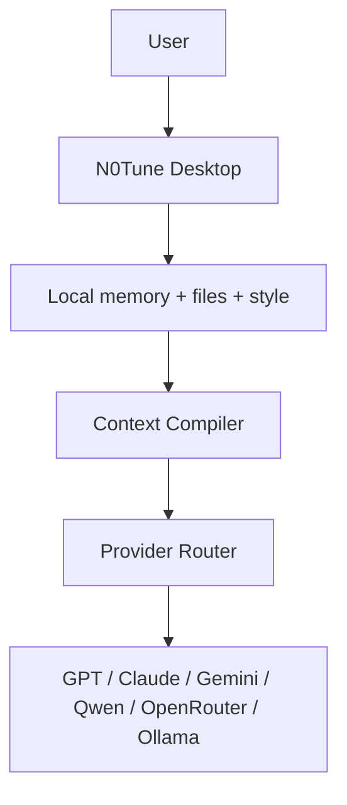

<p align="center">
  
</p>

<p align="center"><strong>Armor for your AI tools.</strong></p>

<p align="center">
  Local memory, token-savings, and tailored context for Claude Code, Claude Desktop,<br/>
  Cursor, Codex CLI, Gemini CLI, and any OpenAI-compatible client.
</p>

<p align="center"><em>Same model. Same question. Personalized answer. Fewer tokens. No fine-tuning.</em></p>

<p align="center">
  <a href="docs/install.md">Install</a> ·
  <a href="docs/product-direction.md">Direction</a> ·
  <a href="docs/how-it-works.md">How it works</a> ·
  <a href="docs/wire-to-claude.md">Wire to Claude</a> ·
  <a href="docs/wire-to-codex-cli.md">Codex CLI</a> ·
  <a href="docs/wire-to-gemini-cli.md">Gemini CLI</a> ·
  <a href="docs/roadmap.md">Roadmap</a>
</p>

<p align="center">
  <sub>Pronounced "no tune" — the display wordmark is the logo above; packages, CLIs, and Docker images all use <code>n0tune</code>.</sub>
</p>

## What N0Tune Is

N0Tune is **armor for the AI tools you already use**. You keep using Claude
Code, Cursor, Codex CLI, Gemini CLI, ChatGPT, whatever — and N0Tune adds a
local memory layer, a context compiler, a token-savings tracker, and a
status overlay around them.

It is not a replacement chat app. The fallback chat exists for when you
have nothing else open; it is the *least* important capability.

### The four canonical surfaces

| You're using…                            | N0Tune adds…                                                                   |
| ---------------------------------------- | ------------------------------------------------------------------------------ |
| Claude Code / Claude Desktop / Cursor    | MCP server: 7 tools that read & write your memory, style, persona, files       |
| Codex CLI                                | Same MCP wiring (Codex supports MCP). See [`docs/wire-to-codex-cli.md`](docs/wire-to-codex-cli.md) |
| Gemini CLI                               | Compiled-prompt adapter + clipboard hotkey. See [`docs/wire-to-gemini-cli.md`](docs/wire-to-gemini-cli.md) |
| ChatGPT / any OpenAI-compatible client   | Gateway proxy at `/v1/openai/chat/completions` adds memory before forwarding   |
| No AI tool open                          | Desktop chat is the fallback                                                   |

### Context-tuning, not fine-tuning

Fine-tuning changes model weights. N0Tune does not.

N0Tune changes the **prompt**. It pulls your relevant memories, your style
profile, and any retrieved file chunks, fits them into a token budget, and
sends a compact context to whatever model you chose. Same model. Different
prompt. Personal answer.

The pattern is called **context-tuning**. See [`docs/context-tuning.md`](docs/context-tuning.md)
for the honest one-pager.

N0Tune is:

- an augmentation layer for existing AI tools (Claude Code, Cursor, Codex CLI…)
- a local-first AI memory layer
- a context compiler
- a token-savings + cache instrumentation surface
- a continual-learning loop (memories summarize and consolidate over time)
- a desktop tray + global hotkey for cross-tool memory capture
- an MCP server, an OpenAI-compatible proxy, and a Python/TS SDK
- open-source, Apache-2.0, no telemetry

N0Tune is not:

- a model
- a fine-tuning service
- a hosted model provider
- a replacement for Claude Code / Cursor / etc.
- a secret manager
- a guarantee against hallucinations
- a system that stores private memory in the cloud by default

## Product Editions

| Edition            | Who it is for                                             | Status                                                                           |
| ------------------ | --------------------------------------------------------- | -------------------------------------------------------------------------------- |
| **N0Tune Desktop** | Normal users who want a personal AI on their machine      | Planned Desktop Alpha; architecture documented                                   |
| **N0Tune Core**    | Developers building context-tuned apps                    | Python Core package started; shared compiler/security/token primitives           |
| **N0Tune CLI**     | Developers and power users                                | Planned diagnostics, demo, import/export, MCP setup                              |
| **N0Tune MCP**     | Claude Desktop, Claude Code, Cursor, and compatible tools | Existing MCP server integration, to be expanded for local-first Desktop          |
| **N0Tune Gateway** | Developers and teams running an API/server mode           | Existing FastAPI server, proxy, permissions, audit logs, evals, and integrations |

The public-facing product should become Desktop first. The current server/API work remains valuable and is now framed as **N0Tune Gateway**.

## How It Works



For every request, N0Tune decides:

- which memories matter
- which local file chunks matter
- which style profile should apply
- which context is unsafe, stale, redundant, or too expensive
- whether a semantic cache entry can be reused
- what compact context should be sent to the selected model

The selected model receives a normal prompt with useful context. The model weights do not change.

## Fine-Tuning vs N0Tune

| Fine-tuning                              | N0Tune                                                  |
| ---------------------------------------- | ------------------------------------------------------- |
| Changes model weights                    | Changes request context                                 |
| Expensive for large models               | Works with hosted or local models                       |
| Slow to update                           | Updates as memory/files/style change                    |
| Usually provider-specific                | Designed for any provider or OpenAI-compatible endpoint |
| Needs training data and often GPU access | Needs local memory, files, and context compilation      |
| Not personal per user unless retrained   | Personal per user/persona by design                     |

N0Tune is not a replacement for all fine-tuning use cases. It is for personalization, memory, local files, style, and transparent context control.

## Current Repository Status

This repository already contains the foundation for N0Tune Gateway:

- FastAPI API in `apps/api`
- reusable Python Core package in `packages/core`
- Postgres + pgvector migrations
- Redis-ready rate limiting and health checks
- memory CRUD, lifecycle, scope, export, confirm, soft delete, and hard delete paths
- style profile CRUD
- document chunking and RAG context selection
- context preview with trace and token estimates
- prompt-injection and secret checks
- semantic cache
- provider router with development and OpenAI-compatible paths
- OpenAI-compatible chat completions endpoint
- API keys, RBAC, and audit logs
- dashboard in `apps/dashboard`
- MCP stdio server in `integrations/mcp-server`
- Markdown-folder connector
- Python and TypeScript SDKs
- LangChain, LlamaIndex, and Vercel AI SDK integrations
- evaluation harness and dogfooding scripts
- production, security, scaling, backup, and observability docs

Desktop and CLI are documented but are not implemented yet. Core has started as a Python package used by Gateway for shared context-tuning primitives.

## Gateway Quickstart

Use this path to run the existing server mode today:

```powershell
Copy-Item .env.example .env
docker compose config
docker compose up --build
```

Open:

- Dashboard: `http://localhost:3000`
- API health: `http://localhost:8000/health?deep=true`

The dashboard includes a **Context Lab** tab for a no-fake-output product demo:

- create/select User A and User B
- seed different style memories and style profiles
- ask the same question for both users
- call `/v1/context/preview` for both
- compare selected memories, selected document chunks, compiled context, token estimates, token savings, warnings, and trace entries side by side

Context Lab uses context preview only. It does not fake LLM responses.

Run checks:

```powershell
.\scripts\check-mvp.ps1
.\scripts\smoke-mvp.ps1
npm run test
npm run build
```

## Example Gateway API Calls

Create a memory:

```powershell
Invoke-RestMethod -Method Post -Uri http://localhost:8000/v1/memories -ContentType "application/json" -Body '{
  "app_id": "demo",
  "user_id": "user_123",
  "type": "preference",
  "text": "User prefers short practical answers.",
  "confidence": 0.9
}'
```

Preview context:

```powershell
Invoke-RestMethod -Method Post -Uri http://localhost:8000/v1/context/preview -ContentType "application/json" -Body '{
  "app_id": "demo",
  "user_id": "user_123",
  "message": "Explain RAG like before",
  "max_context_tokens": 1200
}'
```

Chat through N0Tune:

```powershell
Invoke-RestMethod -Method Post -Uri http://localhost:8000/v1/chat -ContentType "application/json" -Body '{
  "app_id": "demo",
  "user_id": "user_123",
  "message": "Explain RAG like before",
  "model": "n0tune/dev"
}'
```

`n0tune/dev` is a local development provider. It proves routing and context compilation without making an external LLM call. Configure `N0TUNE_PROVIDER_BASE_URL` and `N0TUNE_PROVIDER_API_KEY` for an OpenAI-compatible provider.

## SDK Usage

```ts
import { N0TuneClient } from "@n0tune/sdk";

const client = new N0TuneClient({ baseUrl: "http://localhost:8000" });

await client.createMemory({
  app_id: "demo",
  user_id: "user_123",
  type: "preference",
  text: "User prefers concise answers.",
});

const preview = await client.contextPreview({
  app_id: "demo",
  user_id: "user_123",
  message: "Explain RAG like before",
});

console.log(preview.compiled_context);
```

## OpenAI-Compatible Proxy

Endpoint:

```text
POST /v1/openai/chat/completions
```

Point a compatible client at:

```text
OPENAI_BASE_URL=http://localhost:8000/v1/openai
```

Use headers:

- `X-N0Tune-App-ID: demo`
- `X-N0Tune-User-ID: user_123`
- `Authorization: Bearer <app-api-key>`

## MCP Integration

Run:

```powershell
node integrations/mcp-server/src/server.mjs
```

Current tools:

- `n0tune_search_memories`
- `n0tune_save_memory`
- `n0tune_get_style_profile`
- `n0tune_search_docs`
- `n0tune_context_preview`
- `n0tune_forget_memory`

See [docs/mcp.md](docs/mcp.md).

## Product Docs

- [Product direction](docs/product-direction.md)
- [Editions](docs/editions.md)
- [Context-tuning](docs/context-tuning.md)
- [Desktop architecture](docs/desktop-architecture.md)
- [Roadmap](docs/roadmap.md)
- [Dogfooding](docs/dogfooding.md)
- [Gateway API](docs/api.md)
- [Security](SECURITY.md)

## Roadmap

The next work is intentionally staged:

1. Product reframe
2. Core extraction
3. Desktop Alpha
4. Provider router expansion
5. CLI
6. MCP local-first expansion
7. Local file memory
8. Personas and sharing
9. Floating widget
10. Public alpha release

See [docs/roadmap.md](docs/roadmap.md).

## Contributing

Read [CONTRIBUTING.md](CONTRIBUTING.md). Every behavior change must include tests and docs updates.

## License

N0Tune uses Apache-2.0. Apache-2.0 is open-source friendly and includes an explicit patent grant, which is useful for developer infrastructure projects embedded in commercial and open-source products.
