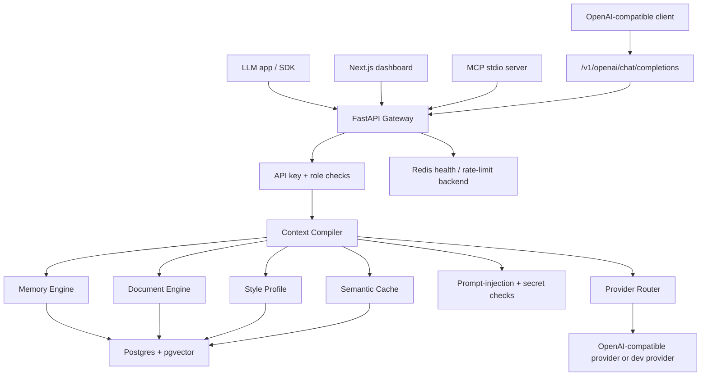
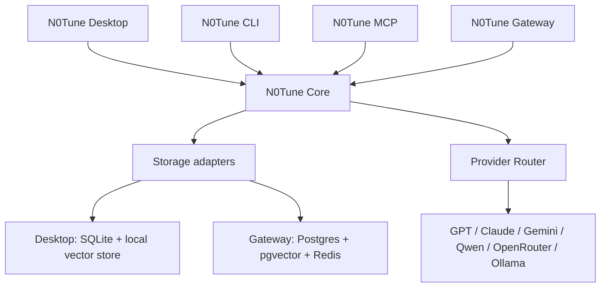
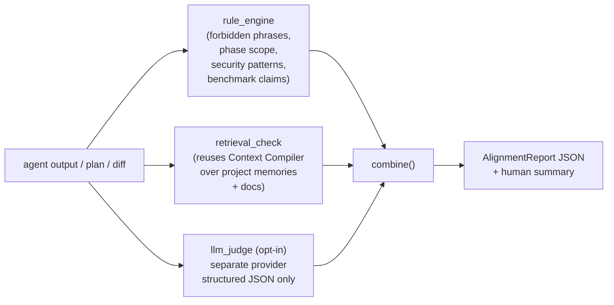

# Architecture

## Project Context Runtime

The Gateway now has a project-context layer above the existing app/user
memory model.

New tables:

- `projects`
- `project_tools`
- `sessions`
- `handoff_capsules`

Updated table:

- `memories.project_id`
- `memories.session_id`
- `memories.handoff_id`

Project detection lives in `apps/api/app/services/project_context.py`.
Routes live in `apps/api/app/routes/projects.py`.

Project context APIs are intentionally thin:

- detect a folder
- save/search project memory
- track sessions
- create/list/archive handoff capsules
- generate continuation prompts

The MCP server and CLI are clients of those routes. They do not keep their
own project database.

This page describes the current Gateway/server architecture and how it should evolve toward Desktop and Core.

For product editions, see [editions.md](editions.md). For Desktop planning, see [desktop-architecture.md](desktop-architecture.md).

## Repository Layout

```text
n0tune/
|-- apps/
|   |-- api              # current FastAPI Gateway
|   |-- dashboard        # current server-mode dashboard
|   `-- desktop          # planned Desktop app placeholder
|-- packages/
|   |-- core             # reusable Python context-tuning primitives
|   |-- cli              # planned n0tune CLI
|   |-- sdk-js
|   `-- sdk-py
|-- integrations/
|   |-- mcp-server
|   |-- markdown-folder
|   |-- langchain
|   |-- llamaindex
|   `-- vercel-ai-sdk
|-- examples/
|-- personas/
|-- docs/
`-- scripts/
```

## Current Gateway Runtime



## Target Product Runtime



## Database

Gateway migrations create:

- `apps`
- `users`
- `conversations`
- `messages`
- `memories`
- `style_profiles`
- `documents`
- `document_chunks`
- `semantic_cache`
- `context_runs`
- `feedback_events`
- `api_keys`
- `audit_logs`

PostgreSQL migrations enable `pgvector` and create vector columns for memories, document chunks, and semantic cache inputs. Tests use SQLite with the same SQLAlchemy models.

Desktop should not use this server database directly. It should use local SQLite and a local vector store through Core adapters.

## Context Compiler

The current compiler implementation lives in `apps/api/app/services/context/compiler.py`.

The compiler:

1. embeds the user message
2. retrieves scoped memories
3. retrieves scoped document chunks
4. loads style profile
5. excludes high-risk prompt-injection chunks
6. fits selected context into the token budget
7. emits a trace and token-savings estimate
8. supports semantic-cache lookup and storage through the chat path

Phase B has started extracting reusable compiler logic into `packages/core` while keeping Gateway storage in an adapter.

## Provider Router

The default `n0tune/dev` provider is local and does not call an external LLM. OpenAI-compatible routing is available through environment variables.

Future provider routing should support:

- OpenAI
- Anthropic Claude
- Google Gemini
- Qwen via official API or OpenRouter-compatible route
- OpenRouter
- Ollama
- LM Studio
- custom OpenAI-compatible endpoints

## Context Guard (Phase CG, design-only at v0.1.2)

Context Guard is the planned alignment + grounding layer that checks
whether an AI agent's proposed plan or response stays aligned with the
project's stored direction, current phase, security rules, and
benchmarks. Full spec in [`docs/context-guard.md`](context-guard.md)
and [`docs/alignment-checker.md`](alignment-checker.md).

Planned engine sits next to the Context Compiler:



New table (CG-1): `alignment_rules` (one row per rule, app-scoped,
admin-write).

New endpoints (CG-2):

- `POST /v1/alignment/check`
- `POST /v1/alignment/check-diff`
- `GET /v1/alignment/rules`
- `POST /v1/alignment/rules` (admin only)

New MCP tools (CG-5): `n0tune_alignment_check`,
`n0tune_get_current_plan`, `n0tune_remind_context`.

At v0.1.2 none of this is implemented. The semantic cache, context
compiler, provider router, and memory consolidation are untouched and
keep working as documented above.

## Known Gaps

- Desktop app is not implemented yet.
- Core package extraction is partial: shared token, security, lexical, score-blending, and context-formatting logic is implemented, while storage/provider/cache orchestration remains in Gateway.
- CLI is not implemented yet.
- Desktop local SQLite/vector adapters are not implemented yet.
- Native Postgres `tsvector` retrieval is still future work.
- OpenAI embedding calls are currently synchronous.
- Context Guard is **design-only** as of v0.1.2; engine + endpoint + UI
  + CLI + MCP tools all land in subsequent CG sub-phases.
