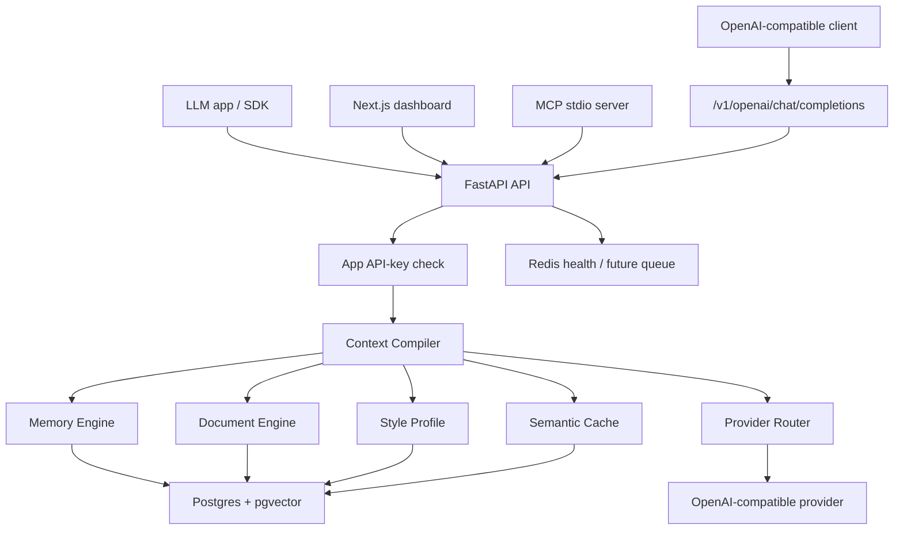

# Architecture

N0Tune is a monorepo with a Python API, Next.js dashboard, TypeScript SDK, MCP server, integrations, examples, and docs.

## Repository layout

```text
n0tune/
|-- apps/api
|-- apps/dashboard
|-- packages/sdk-js
|-- integrations/mcp-server
|-- examples
|-- docs
`-- scripts
```

## Runtime



## Database

Alembic creates:

- `apps`
- `users`
- `conversations`
- `messages`
- `memories`
- `style_profiles`
- `documents`
- `document_chunks`
- `semantic_cache`
- `context_runs`
- `feedback_events`

PostgreSQL migrations enable `pgvector` and create vector columns for memories, document chunks, and semantic cache inputs. Tests use SQLite with the same SQLAlchemy models.

## Context Compiler

The compiler:

1. embeds the user message with deterministic local embeddings
2. retrieves user memories scoped by `app_id` and `user_id`
3. retrieves document chunks scoped by `app_id`
4. loads style profile
5. excludes high-risk prompt-injection chunks
6. fits selected context into the token budget
7. emits a trace and token-savings estimate

## Provider Router

The default `n0tune/dev` provider is local and does not call an external LLM. OpenAI-compatible routing is available through environment variables.

## Known limitations

- deterministic local embeddings are suitable for MVP smoke tests, not production semantic quality
- no hybrid BM25 search yet
- no streaming proxy yet
- rate limiting is documented but not implemented
- Redis is included for infrastructure readiness, while MVP cache entries are persisted in Postgres for dependency tracking
