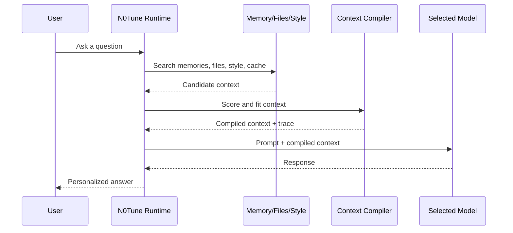

# Context-Tuning

N0Tune uses context-tuning: fine-tune-like personalization without fine-tuning.

Fine-tuning changes the model.
N0Tune changes the context around the model.

## What Context-Tuning Means

Context-tuning is the process of building a compact, relevant, user-specific prompt around a model request.

N0Tune uses:

- local memory
- style profiles
- file and document context
- semantic cache
- context compilation
- provider routing
- prompt-injection and secret checks

The selected model receives normal input. Its weights do not change.

## What It Does Not Mean

N0Tune does not:

- train GPT
- fine-tune Claude
- fine-tune Gemini
- fine-tune Qwen
- alter hosted model weights
- download or own a hosted model
- guarantee factual correctness

It can make a model feel personal because the right context is included at the right time.

## Request Flow

## Context Sources

Memories:

- preferences
- goals
- project facts
- corrections
- durable personal details the user wants remembered

Style:

- tone
- detail level
- answer format
- things to avoid

Files:

- selected folders only
- `.md` and `.txt` first
- prompt-injection checks before inclusion
- future PDF support

Cache:

- reuse similar answers when safe
- respect TTL and dependency freshness
- invalidate when relevant memory changes

## Why Context Preview Matters

Context preview makes personalization inspectable.

A user should be able to see:

- memories used
- file chunks used
- style profile used
- compiled context
- estimated tokens
- excluded risky content

This is a product advantage over opaque personalization systems.

## Limits

Context-tuning is best for:

- personal preferences
- local memory
- project context
- writing style
- repeated workflows
- file-grounded answers

Fine-tuning may still be better for:

- changing base model behavior at scale
- learning a stable specialized task
- domain adaptation from large labelled datasets
- reducing prompt length for fixed behavior

N0Tune should be honest about that boundary.

## Privacy Rules

- Private memory is local by default in Desktop mode.
- Persona sharing excludes private memories by default.
- File indexing is opt-in.
- Provider API keys are not included in context.
- MCP should be local-only by default.
- Logs must not expose secrets.
