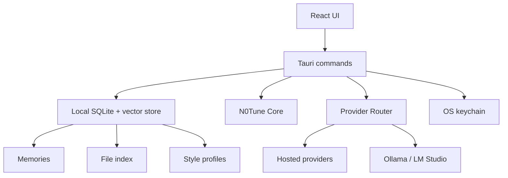

# Desktop Architecture

N0Tune Desktop is the planned local app for normal users. It is not implemented yet in Phase A.

The goal is a downloadable app that turns a chosen hosted or local model into a personal AI through local memory, style, files, semantic cache, and context compilation.

## Stack Decision

Default recommendation: Tauri + React + TypeScript.

Reasons:

- lighter than Electron
- good fit for local-first desktop apps
- can ship native desktop binaries
- Rust shell can safely bridge to OS keychain and local files
- React UI can share design and typed contracts with future Core packages

Electron is acceptable for MVP only if Tauri blocks shipping speed. The default plan remains Tauri.

## Desktop Responsibilities

N0Tune Desktop should provide:

- first-run onboarding
- provider settings
- chat UI
- persona manager
- style profile editor
- local memory viewer/editor/delete/export
- context preview
- selected folder indexing for `.md` and `.txt`
- simple tray or popup quick chat later

The app should not require Postgres or Redis.

## Local Architecture

## Storage

Desktop storage should be local by default:

- SQLite for app data
- sqlite-vec, LanceDB, or equivalent for local vector search
- local file index for selected folders
- OS keychain for provider secrets where practical
- no cloud sync unless explicitly added later

Private memories should stay on the user's machine by default.

## First-Run Onboarding

The first-run flow should ask for:

- AI name
- avatar or preset
- model provider
- API key or local endpoint
- memory mode
- preferred response style
- optional folders to index

The user should be able to skip provider setup and use a local demo mode if supported by the installed environment.

## Provider Settings

MVP provider choices:

- OpenAI
- Anthropic Claude
- Google Gemini
- OpenRouter or custom OpenAI-compatible endpoint
- Ollama or local endpoint

Rules:

- never log API keys
- store keys in the OS keychain if possible
- allow deleting provider keys
- show which provider/model answered each message
- support custom OpenAI-compatible base URL and model id

## Chat UI

MVP chat should show:

- messages
- selected model/provider
- memory/context indicator
- token estimate when available
- context preview entry point
- errors that explain provider or local config problems without exposing secrets

## Memory UX

The user must be able to:

- disable auto-memory
- view memories
- edit memories
- delete memories
- export memories
- understand why a memory was used

Useful memory types include preferences, goals, project context, style corrections, and long-lived facts the user explicitly wants remembered.

## Context Preview

Context preview is a key differentiator. The desktop app should expose:

- memories used
- file chunks used
- style profile used
- compiled context
- estimated tokens
- excluded risky content
- provider/model selected

This helps users trust personalization because they can inspect what N0Tune sent to the model.

## File Indexing

MVP:

- user selects folders explicitly
- index `.md` and `.txt`
- show indexed file count
- support resync
- scan for prompt-injection risk before including chunks

Later:

- PDF
- richer file permissions
- per-folder include/exclude rules
- encrypted backup

## Avatar and Companion Plan

Do not block Desktop Alpha on 3D.

MVP:

- use `img/logo.png`
- simple 2D avatar presets
- custom PNG upload
- custom AI name

Future:

- Live2D
- VRM 3D avatars
- persona gallery
- animated desktop companion

Only use assets with explicit permissive licenses.

## Relationship to Gateway

The existing Gateway proves the server implementation of memory, documents, style, context preview, semantic cache, provider routing, permissions, audit logs, and API compatibility.

Desktop should reuse the same concepts through N0Tune Core, but it should use local SQLite/vector storage instead of requiring Postgres and Redis.

## Phase A Status

This document is architecture only. There is no Desktop implementation in this repo yet.
