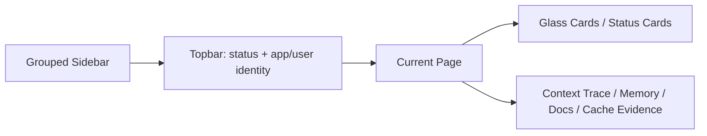

# N0Tune UI Redesign

N0Tune is an open-source Personal AI Runtime and Context Compiler.

The dashboard should feel like a control room for a personal AI brain, not a
basic admin panel. The product story has to be obvious in one screen:

> Bring any model. N0Tune makes it yours.

Fine-tuning changes the model. N0Tune changes the context around the model.

## UI-0 Audit

### Current Dashboard Surface

The dashboard is a single Next.js route at `apps/dashboard/app/page.tsx` with
one client component, `apps/dashboard/components/dashboard-app.tsx`.

Before this redesign, the dashboard already had real Gateway wiring:

- memory create/list/delete
- style profile view/edit
- document create/list
- context preview
- token estimates and token savings
- context trace
- semantic cache list/clear
- audit log loading with owner/admin API key
- security notes
- Context Lab for two-user context comparison

The main UX issues were:

- the information architecture still felt like a dev console
- home did not explain context-tuning clearly enough
- memory, cache, files, sessions, and handoff were not visually distinct
- planned features sat near real features without enough status labeling
- no design-system primitives existed for the future desktop/dashboard language
- responsive behavior depended on the previous tab layout rather than a real app shell
- several feature surfaces were useful but not screenshot-worthy

### Backend Feature Audit

| Area            | Current backend support                                                                                                                                | UI status                                                          |
| --------------- | ------------------------------------------------------------------------------------------------------------------------------------------------------ | ------------------------------------------------------------------ |
| Memory          | `memories` table with type, state, scope, confidence, source, lifecycle timestamps, version, replacement, export, confirm, consolidate, update, delete | Live, library shelves are UI-1 grouping only                       |
| Style           | `style_profiles` table and GET/PATCH endpoints, plus style adaptation route in source                                                                  | Live edit form                                                     |
| Documents       | `documents` and `document_chunks`, content hash, source, metadata, injection-risk score/reasons                                                        | Live document indexing/list                                        |
| Context preview | `/v1/context/preview` returns selected memories, chunks, style, warnings, token estimate, savings, trace                                               | Live                                                               |
| Chat            | `/v1/chat` exists with provider routing and semantic cache                                                                                             | Not foregrounded in UI-1 because Context Lab must not fake answers |
| Cache           | `semantic_cache`, dependency JSON, TTL, context hash, cache list/clear, context runs                                                                   | Live cache page                                                    |
| Sessions        | `conversations`, `messages`, `token_count`, `context_runs` exist                                                                                       | Planned session UX; no full session summary endpoint               |
| Handoffs        | No `handoff_capsules` table or `/v1/handoffs` endpoints                                                                                                | Planned only                                                       |
| MCP             | Stdio MCP server with memory/style/docs/context/persona/alignment tools                                                                                | Partial; live docs/tool list, no dashboard connection test         |
| Provider setup  | Provider router supports OpenAI-compatible, Anthropic, Gemini paths through env config                                                                 | Planned dashboard key UI                                           |
| Security        | secret detection, prompt-injection scoring, scoped data, API keys, RBAC, audit logs                                                                    | Live status cards                                                  |
| Audit           | `audit_logs`, API keys, permissions routes                                                                                                             | Live with owner/admin key                                          |

## Design Direction

The new dashboard direction is a dark liquid-glass command center with soft
depth and restrained motion. It should be friendly and premium without turning
into a toy.

Design principles:

- explain context-tuning in plain language
- show evidence before claims
- distinguish memory, files, cache, sessions, and handoffs
- label every planned surface clearly
- keep the Gateway useful for developers while making Desktop/Personal AI the story
- avoid fake model responses
- keep performance predictable: no WebGL or heavy canvas in the dashboard shell

## Color System

Implemented as CSS variables in `apps/dashboard/app/globals.css`.

| Token         | Value                    | Use                                     |
| ------------- | ------------------------ | --------------------------------------- |
| `--bg`        | `#070a12`                | deep app background                     |
| `--bg-2`      | `#0b1020`                | dark panel depth                        |
| `--memory`    | `#4de1d2`                | memory, context health, primary actions |
| `--model`     | `#6c7cff`                | provider routing, planned/system states |
| `--context`   | `#8b5cf6`                | compiled context and MCP bridge         |
| `--companion` | `#ffb86b`                | companion energy and active attention   |
| `--success`   | `#34d399`                | healthy states                          |
| `--warning`   | `#fbbf24`                | watch states                            |
| `--danger`    | `#fb7185`                | security/risk states                    |
| `--surface`   | `rgba(255,255,255,0.08)` | glass panels                            |
| `--line`      | `rgba(255,255,255,0.16)` | glass borders                           |

Light-mode variables exist for later, but dark mode is the hero.

## Typography

- UI font: Inter/Geist/system sans.
- Code/context font: JetBrains Mono/Geist Mono/system mono.
- Dashboard headings are confident but not marketing-sized inside dense surfaces.
- Metadata uses small uppercase labels and tabular numerals.
- Long explanation is kept out of cards unless it helps users decide what to do.

## Layout Structure



Primary navigation:

- Command Center
- Context Lab
- Memory Library
- Sessions
- Handoff
- Models
- Files
- MCP & Plugins
- Cache
- Security
- Audit Logs
- Settings

Each item has a status:

- `live`: backed by existing API behavior
- `partial`: some real support exists but UX/backend is incomplete
- `planned`: design placeholder only

## Page Map

| Page           | v0.1.6 status | Notes                                                                                                     |
| -------------- | ------------- | --------------------------------------------------------------------------------------------------------- |
| Command Center | Live          | companion with adaptive mood, context health, memory/doc/cache/security stats, quick preview              |
| Context Lab    | Live          | two-user context preview, no fake LLM response                                                            |
| Memory Library | Live          | CRUD + shelves-as-filters + semantic search via `?q=` + Memory Quality heuristics                         |
| Sessions       | Partial       | token danger meter + per-run detail on top of `context_runs`; full session summary endpoint still planned |
| Handoff        | Planned       | example capsule + planned endpoint and MCP tool list. `/v1/handoffs` not implemented                      |
| Models         | Live          | provider cards with real `N0TUNE_PROVIDER_*` env vars + Copy buttons; in-dashboard key form planned       |
| Files          | Live          | document indexing/listing/chunk risk                                                                      |
| MCP & Plugins  | Partial       | live tool list + copy-config blocks for Claude Desktop / Code / Cursor / Codex; in-dashboard handshake planned |
| Cache          | Live          | list/clear cache and context-run hit rate                                                                 |
| Security       | Live          | live risk counts plus planned provider-key note                                                           |
| Audit Logs     | Live          | requires owner/admin API key                                                                              |
| Settings       | Live          | workspace, theme, motion, demo labels, memory export, developer/about                                     |

## Component System

Implemented primitives:

- `GlassCard`
- `StatCard`
- `StatusPill`
- `EmptyState`
- `LoadingSkeleton`
- `ErrorState`
- `SectionHeader`
- `TokenSavingsMeter`

Dashboard-specific components:

- `AppShell`
- `CommandCenter`
- `ContextLab`
- `ContextPreviewPanel`
- `MemoryLibrary`
- `MemoryShelves`
- `MemoryCard`
- `FilesPage`
- `CachePage`
- `SecurityPage`
- `AuditPage`
- planned-page shells

## Responsive Rules

Breakpoints:

- mobile: `< 768px`
- tablet: `768-1024px`
- desktop: `> 1024px`
- wide: `> 1440px`

Rules:

- desktop uses a persistent sidebar and multi-column content
- tablet collapses the shell to a stacked sidebar/top content layout
- mobile stacks all cards and makes actions full width
- context preview panels wrap and keep compiled context scrollable
- no text should rely on horizontal overflow to be readable

## Animation And Effects

Allowed in UI-1:

- backdrop blur on shell/topbar/cards
- gentle hover lift
- subtle grid/noise texture
- skeleton shimmer
- reduced-motion override

Avoided:

- WebGL scenes
- constant motion backgrounds
- heavy blur on every nested element
- fake 3D mascots
- decorative gradient blobs that do not communicate product state

## Common Design Mistakes Found

1. The dashboard still read as a technical operator panel first.
2. It did not foreground "Bring any model. N0Tune makes it yours."
3. Session and handoff concepts were not represented clearly.
4. Backend-supported features and planned ideas were not consistently labeled.
5. Memory was a list, not a library.
6. Cache was not explained as distinct from memory.
7. MCP setup was too documentation-driven.
8. Context-tuning needed clearer plain-language copy.
9. Home had too little visual hierarchy.
10. The previous design system did not match the new Desktop-first direction.

## Handoff Capsule Backend Proposal

Handoff Capsules are planned. Do not present them as live until this exists.

Proposed table:

```text
handoff_capsules
- id
- app_id
- user_id
- source_tool
- target_tool nullable
- title
- goal
- current_state
- summary
- decisions_json
- files_changed_json
- commands_run_json
- open_questions_json
- next_steps_json
- warnings_json
- memory_refs_json
- doc_refs_json
- token_usage_json
- created_at
- updated_at
- archived_at
```

Proposed endpoints:

- `POST /v1/handoffs`
- `GET /v1/handoffs`
- `GET /v1/handoffs/{id}`
- `DELETE /v1/handoffs/{id}`
- `POST /v1/handoffs/from-session`
- `POST /v1/handoffs/{id}/continue-prompt`

Proposed MCP tools:

- `n0tune_create_handoff_capsule`
- `n0tune_get_handoff_capsule`
- `n0tune_list_handoff_capsules`

## Phased Implementation Plan

### UI-0 - Audit And Plan

Completed in this document:

- current dashboard audit
- backend feature audit
- missing pieces
- page map
- responsive and effect rules
- phased implementation plan

### UI-1 - Design System

Implemented:

- new liquid-glass tokens
- AppShell with grouped navigation and topbar
- reusable primitives
- redesigned Command Center
- planned-page status labels

### UI-2 - Command Center Depth (v0.1.6)

Shipped:

- adaptive companion state (Ready / Learning / Watching / Needs setup / Checking)
- topbar quick-stat pills (memory / docs / cache counts)
- footer status bar with docs/roadmap/contribute and live gateway health
- command palette (⌘K) navigation
- existing context-health score retained; session danger lives on the
  Sessions page once that backend exists

### UI-3 - Context Lab Polish (carried)

- model selector — not yet (Context Lab still preview-only by design)
- side-by-side answer when `/v1/chat` is intentionally enabled — deferred
- trace visualization — already present
- screenshot demo seed reset — already present

### UI-4 - Memory Library (v0.1.6)

Shipped:

- shelves-as-filters (All / Preferences / Project / Style / Goals / Archived / Expired / Low confidence)
- semantic + keyword search via `GET /v1/memories?q=`
- Memory Quality panel (low confidence, never confirmed, expiring soon, duplicates)

Deferred:

- explicit conflict/duplicate review UI on top of `POST /v1/memories/consolidate`
- edit-in-place memory form (today: delete + recreate is the supported path)

### UI-5 - Sessions And Handoff Capsules (v0.1.6, partial)

Shipped:

- token danger meter (Safe / Watch / Danger / Critical) on Sessions
- per-run detail panel — selected memories, chunks, style snapshot
- aggregate session stats — total tokens, average per run, tokens saved,
  cache hit rate
- Handoff Capsules page with full example capsule, planned endpoint list,
  and planned MCP tool list

Still planned (needs backend):

- `handoff_capsules` table + `/v1/handoffs` endpoints
- three `n0tune_*_handoff_capsule` MCP tools
- summarize-now session action

### UI-6 - MCP And Providers (v0.1.6, partial)

Shipped:

- copy-config blocks for Claude Desktop, Claude Code, Cursor, Codex CLI
  — each rendered with the dashboard's current `apiBaseUrl`, `appId`,
  and `userId`
- Test Gateway button (hits `/health`)
- provider cards on Models with wire shape, env vars, routing role, and
  privacy posture

Still planned:

- live MCP handshake from the dashboard (stdio servers boot when the
  client starts them, so the dashboard cannot directly probe the MCP)
- per-user provider key storage from the dashboard

### UI-7 - Security, Audit, Polish (v0.1.6)

Shipped:

- footer status bar shared across every page
- reduced-motion override via Settings (data-motion attribute) layered on
  top of the existing `prefers-reduced-motion` media query
- demo-data label toggle in Settings (default on)
- memory export action (download `/v1/memories/export` JSON)
- theme attribute hook (`data-theme="light"` already styled in globals.css)

Still planned:

- advanced audit filters (filter by actor/action/risk level beyond the
  current list view)
- formal accessibility review with axe / pa11y
- mobile screenshot pass on real devices
